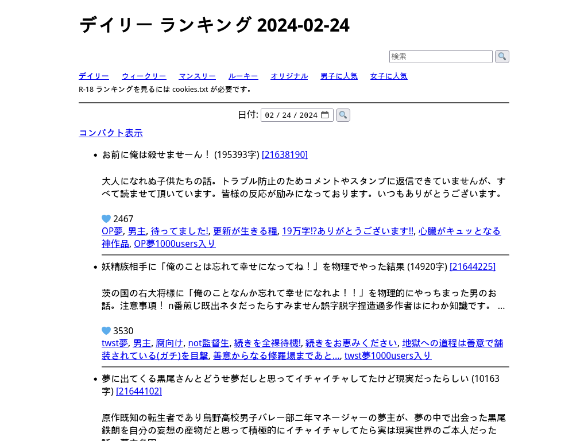
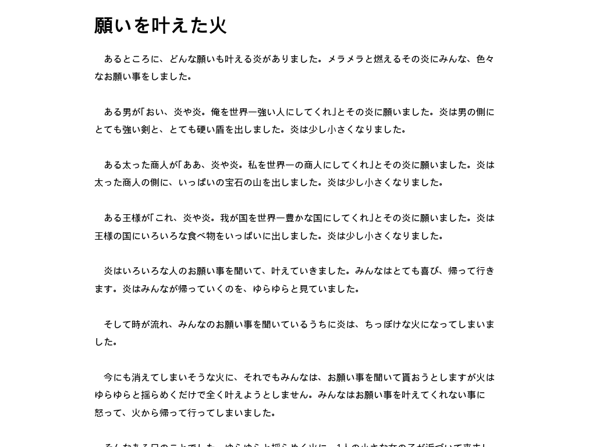

# Alternative frontend for pixiv novels

### Usage
``` sh
curl URLHERE > pixiv-novel.py
python pixiv-novel.py
```

### Screenshots




### Cookies
To search age-restricted contents, put `cookies.txt` in current directory:
1. Login to pixiv.
2. Export `cookies.txt` using this [Chrome addon](https://chrome.google.com/webstore/detail/get-cookiestxt/bgaddhkoddajcdgocldbbfleckgcbcid) or [Firefox addon](https://addons.mozilla.org/ja/firefox/addon/cookies-txt/).
3. Check `cookies.txt` is in the current directory and run script:

    ```sh
    $ grep -i pixiv cookies.txt
    www.pixiv.net   FALSE   /       TRUE    ...
    ...
    $ python pixiv-novel.py
    ```

<!-- or use document.cookie in devtool -->

### Options
```
@RUN ./pixiv-novel.py -h
```

