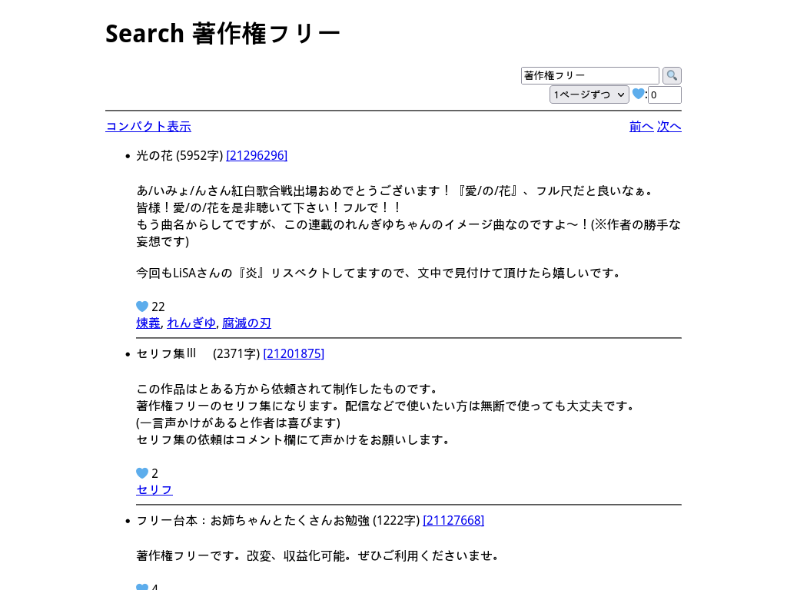

# Lightweight pixiv novel viewer

Lightweight frontend for pixiv novels.

Features: search/view novels, view rankings, search age-restricted contents (with `cookies.txt`), autosave, generates simple html, no javascript, written in python, no 3rd party dependency, also works on android+termux.

### Usage
``` sh
wget 'https://raw.githubusercontent.com/sj2tpgk/pixiv-novel/main/pixiv-novel.py'
python pixiv-novel.py
# Automatically opens daily ranking in browser (localhost:8080 by default)
```

### Screenshots



### Cookies
To search age-restricted contents, put `cookies.txt` in current directory:
1. Login to pixiv.
2. Export `cookies.txt` using this [Chrome addon](https://chrome.google.com/webstore/detail/get-cookiestxt/bgaddhkoddajcdgocldbbfleckgcbcid) or [Firefox addon](https://addons.mozilla.org/ja/firefox/addon/cookies-txt/).
3. Check `cookies.txt` is in the current directory and run script:

    ```sh
    $ grep -i pixiv cookies.txt
    www.pixiv.net   FALSE   /       TRUE    ...
    ...
    $ python pixiv-novel.py
    ```

When `HTTP Error 302` happens, try re-exporting your `cookies.txt`.

<!-- or use document.cookie in devtool -->

### Options
```
@RUN ./pixiv-novel.py -h
```

### Character name colorizer
This script has a feature to colorize each character name with different colors in SS-style novels (e.g. "太郎" in "太郎「こんにちは」").

It needs a database of character names & colors.
See the source code for database definitions.

